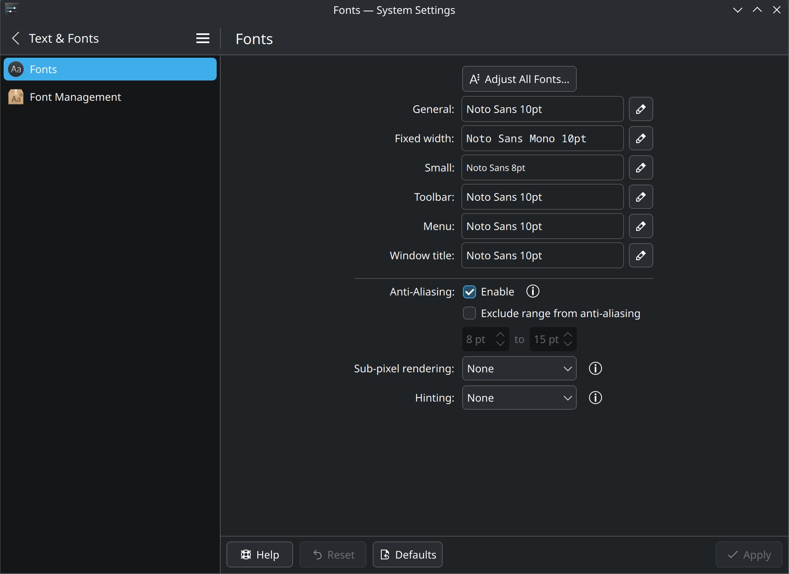

# C++/Qt Dev Environment Setup
This guide helps setting up a Debian-based machine for C++/Qt development on VSCode, with debugging support for many Qt classes through LLDB pretty printers, either locally or on dev containers. I use dev containers for C++/Qt development with and without sanitizers enabled. Two sanitized dev containers are created: one with ASAN+UBSAN and another with TSAN. With the exception of glibc and libresolv, the sanitized container images build sanitized versions for Qt and all of it's dependencies.

Although this guide is Debian-based, you can use it to set up a VSCode based C++/Qt dev environment on you Linux distribution of choice.

## Font Rendering
The first thing I set up is font rendering. For best results on high resolution displays I follow what Apple does and enable grayscale antialiasing without hinting. The `~/.config/fontconfig/fonts.conf` file whose contents are shown below does that (the file also sets some optional bindings that you can omit according to your preferences):

```xml
<?xml version='1.0'?>
<!DOCTYPE fontconfig SYSTEM 'urn:fontconfig:fonts.dtd'>
<fontconfig>
 <match target="font">
  <edit mode="assign" name="antialias">
   <bool>true</bool>
  </edit>
  <edit mode="assign" name="embeddedbitmap">
   <bool>false</bool>
  </edit>
  <edit mode="assign" name="hinting">
   <bool>false</bool>
  </edit>
  <edit mode="assign" name="hintstyle">
   <const>hintnone</const>
  </edit>
  <edit mode="assign" name="lcdfilter">
   <const>lcddefault</const>
  </edit>
  <edit mode="assign" name="rgba">
   <const>none</const>
  </edit>
 </match>
 <alias binding="strong">
  <family>sans-serif</family>
  <prefer>
   <family>Noto Sans</family>
  </prefer>
 </alias>
 <alias binding="strong">
  <family>serif</family>
  <prefer>
   <family>Noto Serif</family>
  </prefer>
 </alias>
 <alias binding="strong">
  <family>monospace</family>
  <prefer>
   <family>Noto Sans Mono</family>
  </prefer>
 </alias>
 <alias binding="strong">
  <family>Consolas</family>
  <prefer>
   <family>Inconsolata</family>
  </prefer>
 </alias>
 <alias binding="strong">
  <family>Gill Sans</family>
  <prefer>
   <family>Cabin</family>
  </prefer>
 </alias>
 <alias binding="strong">
  <family>Verdana</family>
  <prefer>
   <family>Noto Sans</family>
  </prefer>
 </alias>
 <dir>~/.local/share/fonts</dir>
</fontconfig>
```

The KDE Fonts configuration should look like below:

<p align="center">
  
</p>

The `30-metric-aliases.conf` file located at `/etc/fonts/conf.d/` sets metric-compatible fonts as alternatives for many non-free fonts. These metric-compatible fonts are a game changer for text rendering on the Web. On Debian, you can use the command shown below to install metric-compatible and many other useful fonts:

```bash
apt install texlive texlive-fonts-extra fonts-noto fonts-noto-core fonts-noto-color-emoji fonts-noto-extra fonts-noto-mono fonts-noto-ui-core fonts-noto-ui-extra fonts-cabin fonts-cantarell fonts-clear-sans fonts-comfortaa fonts-comic-neue fonts-croscore fonts-crosextra-caladea fonts-crosextra-carlito fonts-dejavu-core fonts-dejavu-extra fonts-ebgaramond-extra fonts-font-awesome fonts-inter fonts-lato fonts-linuxlibertine fonts-lobstertwo fonts-roboto-slab fonts-roboto fonts-open-sans fonts-inconsolata fonts-adf-accanthis fonts-adf-berenis fonts-adf-gillius fonts-adf-universalis fonts-freefont-otf fonts-freefont-ttf fonts-gfs-artemisia fonts-gfs-complutum fonts-gfs-didot fonts-gfs-neohellenic fonts-gfs-olga fonts-gfs-solomos fonts-go fonts-oflb-asana-math fonts-paratype fonts-sil-andika fonts-sil-charis fonts-sil-gentium fonts-sil-gentium-basic fonts-sil-gentiumplus fonts-sil-gentiumplus-compact fonts-stix texlive-fonts-extra-links texlive-fonts-recommended
```

## VSCode Setup

### LLVM Toolchain
Before installing VSCode, I build a LLVM toolchain (Clang, LLD, LLDB) and install it under `/usr/local` with the following commands (you can also use the LLVM apt repo at https://apt.llvm.org/ to install clang+tools without compiling it):

```bash
# If you are using this script to update an existing LLVM installation,
# previously built with this script, uninstall this previous installation
# first by running the following command:
xargs rm < /usr/local/share/uninstallers/llvm/install_manifest.txt
# Set LLVM_VERSION to the desired version
# Note that lldb-dap with version >= 22 is not yet supported by the 
# LLDB DAP extension (vscode version 1.115.0; LLDB DAP extension version 0.4.1)
export LLVM_VERSION=21.1.8
DEBIAN_FRONTEND=noninteractive apt-get update
DEBIAN_FRONTEND=noninteractive apt-get -y upgrade
DEBIAN_FRONTEND=noninteractive apt-get -y install build-essential lsb-release cmake git gpg wget ninja-build swig liblua5.4-dev lua5.4 llvm clang lld
export LLVM_HOST_TARGET=$(llvm-config --host-target)
export CFLAGS="-Wno-unused-command-line-argument -fPIC -fno-omit-frame-pointer"
export CXXFLAGS="-Wno-unused-command-line-argument -fPIC -fno-omit-frame-pointer -stdlib=libstdc++ -std=c++20"
export LDFLAGS="-Wno-unused-command-line-argument -fno-omit-frame-pointer -rtlib=libgcc -stdlib=libstdc++"
mkdir -p ~/llvm-build
cd ~/llvm-build
git clone --depth 1 -c advice.detachedHead=false --branch llvmorg-${LLVM_VERSION} https://github.com/llvm/llvm-project
cd llvm-project
mkdir build
cd build
PYTHON_PACKAGES_DIR="$(python3 -c "import sysconfig;print(sysconfig.get_path('purelib'))")"
PYTHON_RELATIVE_PACKAGES_DIR="$(realpath -s --relative-to="/usr/local" "${PYTHON_PACKAGES_DIR}")"
cmake -GNinja ../llvm -DCMAKE_INSTALL_PREFIX="/usr/local" -DCMAKE_BUILD_TYPE="Release" -DLLVM_PARALLEL_LINK_JOBS="1" -DCMAKE_C_COMPILER="clang" -DCMAKE_CXX_COMPILER="clang++" -DLLVM_USE_LINKER="lld" -DLLVM_ENABLE_PIC="ON" -DLLVM_BUILD_LLVM_DYLIB="ON" -DLLVM_LINK_LLVM_DYLIB="ON" -DLLVM_INSTALL_TOOLCHAIN_ONLY="ON" -DLLVM_ENABLE_LTO="OFF" -DLLVM_TARGETS_TO_BUILD="Native" -DLLVM_DEFAULT_TARGET_TRIPLE="${LLVM_HOST_TARGET}" -DLLVM_ENABLE_PROJECTS="clang;clang-tools-extra;lld;lldb" -DCLANG_DEFAULT_PIE_ON_LINUX="ON" -DCLANG_DEFAULT_LINKER="lld" -DCLANG_DEFAULT_CXX_STDLIB="libstdc++" -DCLANG_DEFAULT_RTLIB="libgcc" -DCLANG_DEFAULT_UNWINDLIB="libgcc" -DLLVM_INCLUDE_EXAMPLES="OFF" -DLLVM_INCLUDE_TESTS="OFF" -DLLVM_INSTALL_BINUTILS_SYMLINKS="ON" -DLLDB_ENABLE_PYTHON="ON" -DLLDB_ENABLE_LUA="ON" -DLLDB_PYTHON_RELATIVE_PATH="${PYTHON_RELATIVE_PACKAGES_DIR}" -DLLDB_DAP_WELCOME_MESSAGE=""
threads=$(lscpu | awk '/^Thread/{print $NF}')
cores=$(lscpu | awk '/^Core\(/ {print $NF}')
sockets=$(lscpu | awk '/^Socket/{print $NF}')
export THREAD_COUNT=$(( $sockets * $cores * $threads ))
cmake --build . --parallel ${THREAD_COUNT} -- clang lld lldb
cmake --build . --target install --parallel ${THREAD_COUNT}
DEBIAN_FRONTEND=noninteractive apt-get -y remove llvm clang lld llvm-19 clang-19 lld-19
DEBIAN_FRONTEND=noninteractive apt -y autoremove
# We save the install_manifest.txt to /usr/local/share/uninstallers/llvm
# to allow uninstallation prior to installing a newer LLVM version.
mkdir -p /usr/local/share/uninstallers/llvm
cp -f install_manifest.txt /usr/local/share/uninstallers/llvm/
rm -rf ~/llvm-build
```

### VSCode Configuration
The following VSCode extensions are required to enable C++/Qt development with full debugging support and dev containers:

```bash
ms-vscode.cpptools
ms-vscode.cmake-tools
ms-vscode.cpp-devtools
ms-vscode.cpptools-extension-pack
ms-vscode.cpptools-themes
llvm-vs-code-extensions.vscode-clangd
llvm-vs-code-extensions.lldb-dap
theqtcompany.qt
ms-vscode-remote.remote-containers
ms-azuretools.vscode-containers
```

After installing VSCode and the extensions shown above, I configure VSCode by adding the following options to my `settings.json` file (with the exception of `"lldb-dap.executable-path": "/usr/local/bin/lldb-dap"`, the options below are just a reminder to myself and are optional):

```json
{
    "chat.disableAIFeatures": true,
    "telemetry.feedback.enabled": false,
    "telemetry.editStats.enabled": false,
    "telemetry.telemetryLevel": "off",
    "C_Cpp.intelliSenseEngine": "disabled",
    "lldb-dap.executable-path": "/usr/local/bin/lldb-dap",
    "editor.fontSize": 17,
    "editor.fontFamily": "Noto Sans Mono",
    "editor.fontLigatures": "'calt'",
    "editor.fontWeight": "400",
    "editor.lineHeight": 2,
    "editor.links": false,
    "editor.minimap.showSlider": "always",
    "editor.inlayHints.enabled": "off",
    "explorer.compactFolders": false,
    "workbench.tree.indent": 24,
    "workbench.colorCustomizations": {
        "foreground": "#cdbb93",
        "selection.background": "#214283",
        "editor.background": "#121212",
    },
    "editor.semanticHighlighting.enabled": true,
    "editor.semanticTokenColorCustomizations": {
        "enabled": true,
        "rules": {
            "namespace": "#ff8080",
            "type": "#ff8080",
            "class": "#ff8080",
            "enum": "#ff8080",
            "enumMember": "#ff8080",
            "enumConstant": "#ff8080",
            "interface": "#ff8080",
            "struct": "#ff8080",
            "typeParameter": "#ff8080",
            "parameter": "#d8d8d8",
            "variable": "#d8d8d8",
            "variable.local": "#d6bb9a",
            "variable.member": "#9373a5",
            "variable.static.member": "#9aa7d6",
            "property": "#9373a5",
            "event": "#ff8080",
            "function": "#ffc66d",
            "function.member": "#ffc66d",
            "function.static": "#f9b341",
            "method": "#ffc66d",
            "macro": "#ff6aad",
            "keyword": "#45c6d6",
            "modifier": "#ff8080",
            "comment": "#808080",
            "string": "#66a334",
            "number": "#6897bb",
            "regexp": "#ff8080",
            "operator": "#cdbb93",
            "operatorOverload": "#5f8c8a",
            "decorator": "#ff8080",
            "declaration": "#d2d2d2",
            "definition": "#ffc66d",
            "readonly": "#ff8080",
            "static": "#45c6d6",
            "deprecated": "#ff8080",
            "abstract": "#ff8080",
            "async": "#ff8080",
            "modification": "#ff8080",
            "documentation": "#149473",
            "defaultLibrary": "#ff8080",
        }
    },
    "editor.bracketPairColorization.enabled": false,
    "editor.tokenColorCustomizations": {
        "textMateRules": [
            {
                "scope": [
                    "entity.other.attribute",
                ],
                "settings": {
                    "foreground": "#808000",
                }
            },
            {
                "scope": [
                    "storage.type.built-in.primitive",
                    "storage.type.primitive",
                ],
                "settings": {
                    "foreground": "#7ce4fb",
                }
            },
            {
                "scope": [
                    "storage.modifier",
                    "storage.type.modifier",
                    "storage.type.template",
                    "constant.language.nullptr",
                    "variable.language.this",
                ],
                "settings": {
                    "foreground": "#45c6d6",
                }
            },
            {
                "scope": [
                    "storage.modifier.pointer",
                    "storage.modifier.reference",
                ],
                "settings": {
                    "foreground": "#d2d2d2",
                }
            },
            {
                "scope": "punctuation",
                "settings": {
                    "foreground": "#bec0c2"
                }
            },
            {
                "scope": "constant.numeric.decimal",
                "settings": {
                    "foreground": "#6897bb"
                }
            },
            {
                "scope": "constant.numeric.hex",
                "settings": {
                    "foreground": "#777777"
                }
            },
            {
                "scope": "keyword.control.directive",
                "settings": {
                    "foreground": "#ff6aad"
                }
            },
            {
                "scope": [
                    "keyword.control.return",
                    "keyword.control.if",
                    "keyword.control.declaration",
                    "keyword.control.else",
                    "keyword.other.using",
                    "keyword.other.static_assert",
                    "keyword.operator.cast",
                    "storage.type.namespace",
                    "storage.type.class",
                    "constant.language.true",
                    "constant.language.false",
                    "keyword.control.for",
                    "keyword.other.default",
                    "keyword.other.delete",
                    "keyword.control.switch",
                    "keyword.control.case",
                    "keyword.operator.new",
                    "keyword.operator.delete",
                    "keyword.control.break",
                    "keyword.control.while",
                ],
                "settings": {
                    "foreground": "#45c6d6"
                }
            },
            {
                "scope": [
                    "variable.other.object.property",
                    "variable.other.property",
                ],
                "settings": {
                    "foreground": "#9373a5"
                }
            },
            {
                "scope": "string.quoted.other.lt-gt.include",
                "settings": {
                    "foreground": "#66a334",
                }
            },
            {
                "scope": "string.quoted",
                "settings": {
                    "foreground": "#66a334",
                }
            },
        ]
},
"terminal.integrated.gpuAcceleration": "on",
"terminal.integrated.customGlyphs": false,
"diffEditor.ignoreTrimWhitespace": false,
}
```

## Configure CMake/Qt locally
Run the commands `CMake: Scan for Kits` and `Qt: Scan for Qt kits` to search for compilers and Qt installations (you can use the `Qt: Register Qt (by qtpaths or qmake)` to add custom builds of Qt). By default, Qt configures its SDK with system compilers. You can run `CMake: Edit User-Local CMake Kits` to see the configured kits. For Debian Trixie with Qt installed from Qt's online installer, the following kits were configured by the CMake/Qt extensions:

```json
[
  {
    "name": "Clang 21.1.8 x86_64-pc-linux-gnu",
    "compilers": {
      "C": "/usr/local/bin/clang",
      "CXX": "/usr/local/bin/clang++"
    },
    "isTrusted": true
  },
  {
    "name": "Clang-cl 21.1.8 x86_64-pc-windows-msvc",
    "compilers": {
      "C": "/usr/local/bin/clang-cl",
      "CXX": "/usr/local/bin/clang-cl"
    },
    "isTrusted": true
  },
  {
    "name": "GCC 14.2.0 x86_64-linux-gnu",
    "compilers": {
      "C": "/usr/bin/gcc",
      "CXX": "/usr/bin/g++"
    },
    "isTrusted": true
  },
  {
    "name": "SDK-6.10.3-gcc_64",
    "isTrusted": true,
    "preferredGenerator": {
      "name": "Ninja"
    },
    "cmakeSettings": {
      "QT_QML_GENERATE_QMLLS_INI": "ON",
      "CMAKE_CXX_FLAGS_DEBUG_INIT": "-DQT_QML_DEBUG -DQT_DECLARATIVE_DEBUG",
      "CMAKE_CXX_FLAGS_RELWITHDEBINFO_INIT": "-DQT_QML_DEBUG -DQT_DECLARATIVE_DEBUG"
    },
    "environmentVariables": {
      "VSCODE_QT_INSTALLATION": "/home/glauco/Programming/Qt/SDK/6.10.3/gcc_64"
    },
    "toolchainFile": "/home/glauco/Programming/Qt/SDK/6.10.3/gcc_64/lib/cmake/Qt6/qt.toolchain.cmake"
  }
]
```

The system compiler (GCC) and our custom clang build were detected, and Qt was configured to use the system compiler. I added the `Qt-6.10.3-clang` kit to this file to make Qt use the custom clang compiler as follows:

```json
[
  {
    "name": "Clang 21.1.8 x86_64-pc-linux-gnu",
    "compilers": {
      "C": "/usr/local/bin/clang",
      "CXX": "/usr/local/bin/clang++"
    },
    "isTrusted": true
  },
  {
    "name": "Clang-cl 21.1.8 x86_64-pc-windows-msvc",
    "compilers": {
      "C": "/usr/local/bin/clang-cl",
      "CXX": "/usr/local/bin/clang-cl"
    },
    "isTrusted": true
  },
  {
    "name": "GCC 14.2.0 x86_64-linux-gnu",
    "compilers": {
      "C": "/usr/bin/gcc",
      "CXX": "/usr/bin/g++"
    },
    "isTrusted": true
  },
  {
    "name": "Qt-6.10.3-clang",
    "compilers": {
      "C": "/usr/local/bin/clang",
      "CXX": "/usr/local/bin/clang++"
    },
    "isTrusted": true,
    "preferredGenerator": {
      "name": "Ninja"
    },
    "cmakeSettings": {
      "QT_QML_GENERATE_QMLLS_INI": "ON",
      "CMAKE_CXX_FLAGS_DEBUG_INIT": "-DQT_QML_DEBUG -DQT_DECLARATIVE_DEBUG",
      "CMAKE_CXX_FLAGS_RELWITHDEBINFO_INIT": "-DQT_QML_DEBUG -DQT_DECLARATIVE_DEBUG"
    },
    "environmentVariables": {
      "VSCODE_QT_INSTALLATION": "/home/glauco/Programming/Qt/SDK/6.10.3/gcc_64"
    },
    "toolchainFile": "/home/glauco/Programming/Qt/SDK/6.10.3/gcc_64/lib/cmake/Qt6/qt.toolchain.cmake"
  },
  {
    "name": "SDK-6.10.3-gcc_64",
    "isTrusted": true,
    "preferredGenerator": {
      "name": "Ninja"
    },
    "cmakeSettings": {
      "QT_QML_GENERATE_QMLLS_INI": "ON",
      "CMAKE_CXX_FLAGS_DEBUG_INIT": "-DQT_QML_DEBUG -DQT_DECLARATIVE_DEBUG",
      "CMAKE_CXX_FLAGS_RELWITHDEBINFO_INIT": "-DQT_QML_DEBUG -DQT_DECLARATIVE_DEBUG"
    },
    "environmentVariables": {
      "VSCODE_QT_INSTALLATION": "/home/glauco/Programming/Qt/SDK/6.10.3/gcc_64"
    },
    "toolchainFile": "/home/glauco/Programming/Qt/SDK/6.10.3/gcc_64/lib/cmake/Qt6/qt.toolchain.cmake"
  }
]
```

## Setting up a Newer Linux Kernel
This section is optional, but if you run Debian on a notebook, you may find it useful to use a newer Linux kernel than the one shipped by Debian. Fortunatelly, as shown below, setting up a newer kernel on Debian is straighforward.

```bash
KERNEL_VERSION="6.19"
mkdir -p ~/linux-kernel-build
cd ~/linux-kernel-build
git clone --depth 1 -c advice.detachedHead=false --branch v${KERNEL_VERSION} https://github.com/torvalds/linux
cd linux
cp -f /boot/config-`uname -r`* .config
scripts/config --set-str LOCALVERSION "-custom"
scripts/config --set-str MODULE_SIG_KEY certs/signing_key.pem
scripts/config --disable DEBUG_INFO
scripts/config --disable DEBUG_INFO_DWARF_TOOLCHAIN_DEFAULT
make olddefconfig
threads=$(lscpu | awk '/^Thread/{print $NF}')
cores=$(lscpu | awk '/^Core\(/ {print $NF}')
sockets=$(lscpu | awk '/^Socket/{print $NF}')
THREAD_COUNT=$(( $sockets * $cores * $threads ))
make -j${THREAD_COUNT}
# modules will be installed to /lib/modules/${KERNEL_VERSION}-custom
sudo make modules_install
# images will be installed to /boot
sudo make install
sudo update-grub
rm -rf ~/linux-kernel-build
```

If you reboot you can select the newly installed kernel. You can follow the steps below to remove a previously installed kernel:

```bash
# *ALWAYS* check that you are removing the desired modules/images!
KERNEL_VERSION="6.19"
sudo rm -rf $(ls -d /lib/modules/* | grep ${KERNEL_VERSION} | grep -- "-custom")
sudo rm -f $(ls -d /boot/* | grep ${KERNEL_VERSION} | grep -- "-custom")
sudo update-grub
```

Now we can [build](../DevContainers/README.md) the VSCode dev containers for C++/Qt development.
