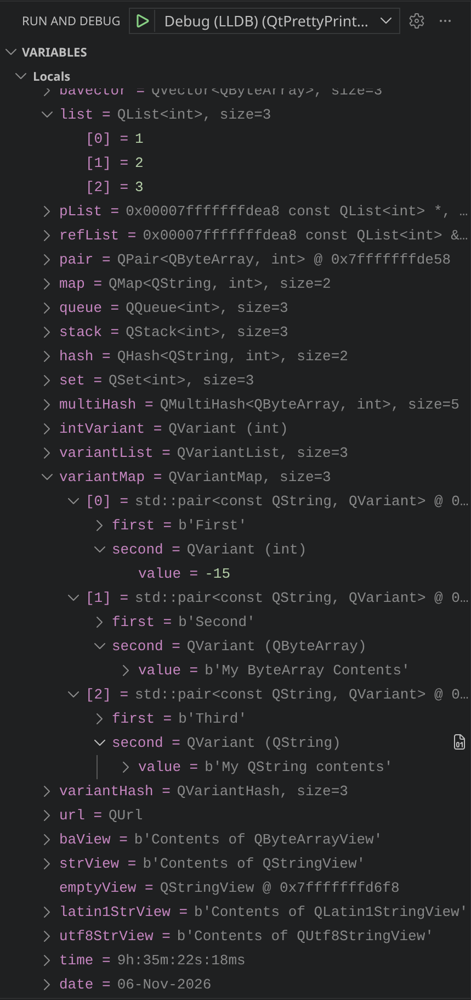

# C++/Qt App Setup on VSCode

Here you can find step-by-step instructions on how to set up a C++/Qt project in VSCode.

Open VSCode and click on `File / Open Folder...` and select the `QtPrettyPrintersTestApp` folder. When VSCode prompts, chose the `Qt-6.10.3-clang` kit (you can chose another kit at any time by running `CMake: Select a Kit`).

As this project has only one target, it's single target was automatically set as both the build and run targets. If your project has many targets, you can run `CMake: Set Build Target` and `CMake: Set Launch/Debug Target` to pick a target for building or running/debugging. You can use the `CMake: Select Variant` command to chose a build type (Debug, Release, RelWithDebugInfo, etc).

You can create a `launch.json` file either directly at the `.vscode` folder on you project directory or by clicking on the Run and Debug button on the Activity Bar and chosing `create a launch.json file`. When VSCode prompts, chose `QtPrettyPrintersTestApp` and then `LLDB DAP Debugger`. You should edit your `launch.json` file to look as follows:

```json
{
    // Use IntelliSense to learn about possible attributes.
    // Hover to view descriptions of existing attributes.
    // For more information, visit: https://go.microsoft.com/fwlink/?linkid=830387
    "version": "0.2.0",
    "configurations": [
        {
            "name": "Debug (LLDB)",
            "type": "lldb-dap",
            "request": "launch",
            "program": "${command:cmake.launchTargetPath}",
            "args": [],
            "env": [],
            "cwd": "${workspaceRoot}",
            "internalConsoleOptions": "openOnSessionStart",
        }
    ]
}
```

You can run `CMake: Build` to build your project and `Ctrl+F5` to run it. You should see `Hello World!` printed at the console.

Now, if you put a breakpoint at the main function return statement and click `F5`, you'll debug the app and when LLDB stops at the breakpoint you'll be able to see all variables with their formatted contents, as shown below:

<p align="center">
  
</p>

## Using Dev Containers

Here, we will set up per-project dev containers with bind mounted volumes, which are pretty fast on Linux. As shown below, setting up dev containers is straighforward:

```bash
# Set PROJECT_ROOT_DIR to your project root dir
PROJECT_ROOT_DIR=/tmp/vscode-projects/QtPrettyPrintersTestApp
# Set KOURIER_DIR to where you cloned Kourier
KOURIER_DIR=/home/$USER/Programming/MyProjects/Kourier
mkdir -p ${PROJECT_ROOT_DIR}/.devcontainer/
cp -rf ${KOURIER_DIR}/VSCode/DevContainers/DevContainers/* ${PROJECT_ROOT_DIR}/.devcontainer/
```

Now run `Dev Containers: Open Folder in Container...` and chose any Qt dev container (Qt6, Qt6-ASAN-UBSAN or Qt-TSAN). If VSCode reports any configuration errors, delete the .cache and build folders on the projects workspace. As we did a custom Qt build inside of the dev containers, the Qt extension is unable to find it. Run `CMake: Scan for Kits` to search for installed compilers and then `Qt: Register Qt (by qtpaths or qmake)`. When prompted, set Qt's qmake6 executable path as follows:

| Qt build type | qmake6 path |
| :-------- | :-------- |
| Unsanitized | /opt/install-root/bin/qmake6 |
| Sanitized | /opt/root-sanitized/bin/qmake6 |

Now, run `CMake: Edit User-Local CMake Kits` and edit the Qt kit to make it use the clang version we built. The Qt kit should look like as shown below:

```json
{
    "name": "Qt-6.11.0-linux-clang-libc++",
    "compilers": {
      "C": "/opt/llvm/21.1.8/bin/clang",
      "CXX": "/opt/llvm/21.1.8/bin/clang++"
    },
    "isTrusted": true,
    "preferredGenerator": {
      "name": "Ninja"
    },
    "cmakeSettings": {
      "QT_QML_GENERATE_QMLLS_INI": "ON",
      "CMAKE_CXX_FLAGS_DEBUG_INIT": "-DQT_QML_DEBUG -DQT_DECLARATIVE_DEBUG",
      "CMAKE_CXX_FLAGS_RELWITHDEBINFO_INIT": "-DQT_QML_DEBUG -DQT_DECLARATIVE_DEBUG"
    },
    "toolchainFile": "/opt/install-root/lib/cmake/Qt6/qt.toolchain.cmake",
    "environmentVariables": {
      "VSCODE_QT_QTPATHS_EXE": "/opt/install-root/bin/qtpaths",
      "PATH": "/opt/install-root:/opt/install-root/doc:/opt/install-root/include:/opt/install-root/lib:/opt/install-root/libexec:/opt/install-root/bin:/opt/install-root/tests:/opt/install-root/plugins:/opt/install-root/qml:/opt/install-root/translations:/opt/install-root/examples:${env:PATH}"
    }
  }
```

After editing your `cmake-tools-kits.json` file, run `Developer: Reload Window` to reload VSCode. When prompted, chose the configured Qt entry (in our case `Qt-6.11.0-linux-clang-libc++` (if not prompted, run `CMake: Select a Kit` and chose the kit explicitly). If CMake fails to configure the project, delete the .cache and build folders and then run `CMake: Configure` again). If you are running the app on the unsanitized dev container, build a debug version of the app (run `CMake: Select Variant` and choose `Debug` when prompted berfore running `CMake: Build`).

If you had chosen the dev container with unsanitized Qt, you can run the app by running `Ctrl+F5` to see a `Hello World!` message printed on the console. If you debug the app (`F5`) after setting a breakpoint at the main function return statement, you'll see that Qt-based variables are nicely formatted with the applied LLDB pretty printers.

If you had chosen to run the app in the ASAN+UBSAN sanitized version of Qt, after hitting `Ctrl+F5` to run the app you'll see an output similiar to the one show below:

```bash

Hello World! 

==3733==LeakSanitizer has encountered a fatal error.
==3733==HINT: For debugging, try setting environment variable LSAN_OPTIONS=verbosity=1:log_threads=1
==3733==HINT: LeakSanitizer does not work under ptrace (strace, gdb, etc)
```

The error informs that we are running under ptrace. This happens because ptrace is what LLDB uses to debug the app. Unfortunatelly, VSCode runs our apps under the debugger even if we run the app using `Debug: Start Without Debugging`. Fortunatelly, the CMake extension provides us with the `CMake: Run Without Debugging` that runs the app outside of LLDB. Running the app outside LLDB shows no errors from ASAN+UBSAN sanitizers.

If you want to print ASAN exit stats even when the app exits without any errors, add `atexit=true` to the `ASAN_OPTIONS` environment variable in the `TERMINAL`, as shown below:

```bash
# Do this on VSCode TERMINAL window
export ASAN_OPTIONS=atexit=true:${ASAN_OPTIONS}
```

Now, if you run `CMake: Run Without Debugging` again, you'll see the stats for Address Sanitizer:

```bash
vscode ➜ /workspaces/QtPrettyPrintersTestApp/build $ export ASAN_OPTIONS=atexit=true:${ASAN_OPTIONS}
vscode ➜ /workspaces/QtPrettyPrintersTestApp/build $ /workspaces/QtPrettyPrintersTestApp/build/QtPrettyPrintersTestApp
Hello World! 

AddressSanitizer exit stats:
Stats: 0M malloced (0M for red zones) by 141 calls
Stats: 0M realloced by 0 calls
Stats: 0M freed by 132 calls
Stats: 0M really freed by 0 calls
Stats: 10M (10M-0M) mmaped; 41 maps, 0 unmaps
  mallocs by size class: 2:5; 3:50; 4:17; 6:19; 7:2; 8:13; 11:5; 12:5; 13:3; 14:8; 16:2; 18:1; 19:1; 21:4; 23:1; 25:1; 27:2; 30:1; 41:1; 
Stats: malloc large: 0
Stats: StackDepot: 250 ids; 9M allocated
Stats: SizeClassAllocator64: 5M mapped (0M rss) in 1958 allocations; remains 1958
  02 (    32): mapped:    256K allocs:     128 frees:       0 inuse:    128 num_freed_chunks    8064 avail:   8192 rss:      4K releases:      0 last released:      0K region: 0x7bed01be0000
  03 (    48): mapped:    256K allocs:     128 frees:       0 inuse:    128 num_freed_chunks    5333 avail:   5461 rss:      4K releases:      0 last released:      0K region: 0x7bfd01be0000
  04 (    64): mapped:    256K allocs:     128 frees:       0 inuse:    128 num_freed_chunks    3968 avail:   4096 rss:      4K releases:      0 last released:      0K region: 0x7c0d01be0000
  06 (    96): mapped:    256K allocs:     128 frees:       0 inuse:    128 num_freed_chunks    2602 avail:   2730 rss:      4K releases:      0 last released:      0K region: 0x7c2d01be0000
  07 (   112): mapped:    256K allocs:     128 frees:       0 inuse:    128 num_freed_chunks    2212 avail:   2340 rss:      4K releases:      0 last released:      0K region: 0x7c3d01be0000
  08 (   128): mapped:    256K allocs:     128 frees:       0 inuse:    128 num_freed_chunks    1920 avail:   2048 rss:      4K releases:      0 last released:      0K region: 0x7c4d01be0000
  11 (   176): mapped:    256K allocs:     128 frees:       0 inuse:    128 num_freed_chunks    1361 avail:   1489 rss:      4K releases:      0 last released:      0K region: 0x7c7d01be0000
  12 (   192): mapped:    256K allocs:     128 frees:       0 inuse:    128 num_freed_chunks    1237 avail:   1365 rss:      4K releases:      0 last released:      0K region: 0x7c8d01be0000
  13 (   208): mapped:    256K allocs:     128 frees:       0 inuse:    128 num_freed_chunks    1132 avail:   1260 rss:      4K releases:      0 last released:      0K region: 0x7c9d01be0000
  14 (   224): mapped:    256K allocs:     128 frees:       0 inuse:    128 num_freed_chunks    1042 avail:   1170 rss:      4K releases:      0 last released:      0K region: 0x7cad01be0000
  16 (   256): mapped:    256K allocs:     128 frees:       0 inuse:    128 num_freed_chunks     896 avail:   1024 rss:      4K releases:      0 last released:      0K region: 0x7ccd01be0000
  18 (   384): mapped:    256K allocs:     128 frees:       0 inuse:    128 num_freed_chunks     554 avail:    682 rss:      4K releases:      0 last released:      0K region: 0x7ced01be0000
  19 (   448): mapped:    256K allocs:     128 frees:       0 inuse:    128 num_freed_chunks     457 avail:    585 rss:      4K releases:      0 last released:      0K region: 0x7cfd01be0000
  21 (   640): mapped:    256K allocs:     102 frees:       0 inuse:    102 num_freed_chunks     307 avail:    409 rss:      4K releases:      0 last released:      0K region: 0x7d1d01be0000
  23 (   896): mapped:    256K allocs:      73 frees:       0 inuse:     73 num_freed_chunks     219 avail:    292 rss:      4K releases:      0 last released:      0K region: 0x7d3d01be0000
  25 (  1280): mapped:    256K allocs:      51 frees:       0 inuse:     51 num_freed_chunks     153 avail:    204 rss:      4K releases:      0 last released:      0K region: 0x7d5d01be0000
  27 (  1792): mapped:    256K allocs:      36 frees:       0 inuse:     36 num_freed_chunks     110 avail:    146 rss:      4K releases:      0 last released:      0K region: 0x7d7d01be0000
  30 (  3072): mapped:    256K allocs:      21 frees:       0 inuse:     21 num_freed_chunks      64 avail:     85 rss:      4K releases:      0 last released:      0K region: 0x7dad01be0000
  36 (  8192): mapped:    256K allocs:       8 frees:       0 inuse:      8 num_freed_chunks      24 avail:     32 rss:      4K releases:      0 last released:      0K region: 0x7e0d01be0000
  41 ( 20480): mapped:    256K allocs:       3 frees:       0 inuse:      3 num_freed_chunks       9 avail:     12 rss:      8K releases:      0 last released:      0K region: 0x7e5d01be0000
Stats: LargeMmapAllocator: allocated 0 times, remains 0 (0 K) max 0 M; by size logs: 
Quarantine limits: global: 256Mb; thread local: 1024Kb
Global quarantine stats: batches: 0; bytes: 0 (user: 0); chunks: 0 (capacity: 0); 0% chunks used; 0% memory overhead
```

Besides providing a blazingly fast and highly conformant server, you can find other useful assets in the Kourier repo. For example, [Spectator](../../../Src/Tests/Spectator/README.md) is a test framework for applying BDD in C++ that is orders of magnitude faster than the alternatives.
